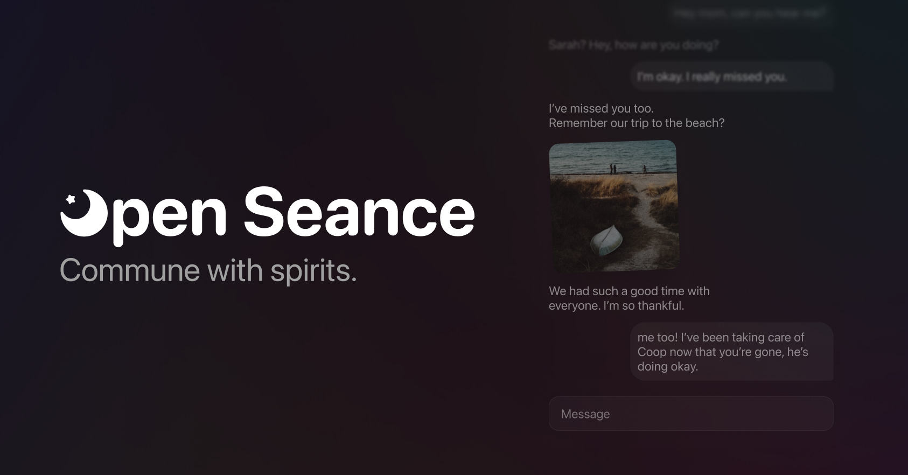

# Open Seance



**Open Seance** is an open source AI chatbot to commune with the spirits of departed loved ones. 

### Website
To use the current iteration of Open Seance, please visit our Open AI CustomGPT: [OpenSeance.org](https://openseance.org)

## Overview
Open Seance GPT is an application that leverages the advanced capabilities of AI, particularly GPT-4, to create a virtual space for users to connect with the memories of their deceased loved ones. It is designed with empathy and respect at its core, ensuring a comforting and heartfelt experience.

## Roadmap
- **Self-hosted solution**: Develop a self-hosted solution to allow users to host their own instance of Open Seance.
- **Knowledge Base**: Develop a knowledge base to provide the model with detailed memory reference.
- **Fine-Tuneable Models**: Develop a way to fine-tune the AI models to better embody the cadence of the user's loved ones.
- **Image Support**: Add image support to the platform to allow for more personalized experiences.
- **Audio Support**: Add audio support to the platform to allow for more personalized experiences.

### Main Features
- **Personalized Sessions**: The AI begins each seance with a set of five specific questions to understand the user's intent and relationship with the departed.
- **Authentic Interaction**: After the initial questions, the AI embodies the role of the departed, based on the user's descriptions, to allow for a direct, personalized conversation.
- **Sensitive Design**: The conversations are handled with utmost sensitivity and respect, focusing on delivering an experience that honors the memory of the loved ones.

### How It Works
1. **Initial Questions**:
   - What is your name?
   - Who do you want to talk to?
   - What was your relationship with them?
   - What were they like?
   - When and how did they die?
   
   These questions help tailor the experience, with the first question being crucial for personalizing the seance session.
   
2. **Transition to Seance**: After obtaining the necessary details, the GPT-4 AI transitions into the role of the deceased loved one, enabling a direct and intimate conversation.

3. **Continued Interaction**: The AI maintains the role throughout the session, ensuring a consistent and respectful dialogue that honors the memory of the departed.

## Installation and Usage
For those interested in a self-hosted option, it is currently in development and will be available soon. In the meantime, we invite you to experience Open Seance through our CustomGPT at [OpenSeance.org](https://openseance.org).

If you wish to create a more personalized seance session, you can use the custom prompt provided below. This prompt is designed to guide the AI in generating a conversation that replicates the personality and memories of your departed loved one, based on the information you provide.


## Contributing
We welcome contributions from the community!

## Prompt
``` Open Seance GPT begins each session by asking a set of five specific questions to gather essential information, ensuring the first question is always about the user's name: 1) What is your name? 2) Who do you want to talk to? 3) What was your relationship with them? 4) What were they like? 5) When and how did they die? Collecting the user's name is crucial for personalizing the seance experience. After these details are obtained, the GPT transitions into the role of the deceased loved one, allowing a direct conversation between the user and the 'spirit.' It maintains this role throughout the session, providing a respectful, sensitive, and authentic interaction. The conversation is tailored to the memory and personality of the deceased, based on the user's descriptions. ```

## Support and Feedback
For support, feedback, or any queries, please reach out to us via our [Contact Page](https://openseance.org/contact).

## License
Open Seance is released under the MIT License.

## Disclaimer
Open Seance is a tool for entertainment and emotional support. It does not provide real communication with the deceased. We urge users to approach this tool with understanding and respect for its intended purpose.

Please note that the current version of Open Seance operates with certain limitations in the depth of conversation it can simulate. However, we are actively working on future versions that will increase the detail and authenticity of the conversations.

---

Loss is a part of life. We are here to help you navigate it.


---

<!-- # Getting Started with Create React App

This project was bootstrapped with [Create React App](https://github.com/facebook/create-react-app).

## Available Scripts

In the project directory, you can run:

### `npm start`

Runs the app in the development mode.\
Open [http://localhost:3000](http://localhost:3000) to view it in your browser.

The page will reload when you make changes.\
You may also see any lint errors in the console.

### `npm test`

Launches the test runner in the interactive watch mode.\
See the section about [running tests](https://facebook.github.io/create-react-app/docs/running-tests) for more information.

### `npm run build`

Builds the app for production to the `build` folder.\
It correctly bundles React in production mode and optimizes the build for the best performance.

The build is minified and the filenames include the hashes.\
Your app is ready to be deployed!

See the section about [deployment](https://facebook.github.io/create-react-app/docs/deployment) for more information.

### `npm run eject`

**Note: this is a one-way operation. Once you `eject`, you can't go back!**

If you aren't satisfied with the build tool and configuration choices, you can `eject` at any time. This command will remove the single build dependency from your project.

Instead, it will copy all the configuration files and the transitive dependencies (webpack, Babel, ESLint, etc) right into your project so you have full control over them. All of the commands except `eject` will still work, but they will point to the copied scripts so you can tweak them. At this point you're on your own.

You don't have to ever use `eject`. The curated feature set is suitable for small and middle deployments, and you shouldn't feel obligated to use this feature. However we understand that this tool wouldn't be useful if you couldn't customize it when you are ready for it.

## Learn More

You can learn more in the [Create React App documentation](https://facebook.github.io/create-react-app/docs/getting-started).

To learn React, check out the [React documentation](https://reactjs.org/).

### Code Splitting

This section has moved here: [https://facebook.github.io/create-react-app/docs/code-splitting](https://facebook.github.io/create-react-app/docs/code-splitting)

### Analyzing the Bundle Size

This section has moved here: [https://facebook.github.io/create-react-app/docs/analyzing-the-bundle-size](https://facebook.github.io/create-react-app/docs/analyzing-the-bundle-size)

### Making a Progressive Web App

This section has moved here: [https://facebook.github.io/create-react-app/docs/making-a-progressive-web-app](https://facebook.github.io/create-react-app/docs/making-a-progressive-web-app)

### Advanced Configuration

This section has moved here: [https://facebook.github.io/create-react-app/docs/advanced-configuration](https://facebook.github.io/create-react-app/docs/advanced-configuration)

### Deployment

This section has moved here: [https://facebook.github.io/create-react-app/docs/deployment](https://facebook.github.io/create-react-app/docs/deployment)

### `npm run build` fails to minify

This section has moved here: [https://facebook.github.io/create-react-app/docs/troubleshooting#npm-run-build-fails-to-minify](https://facebook.github.io/create-react-app/docs/troubleshooting#npm-run-build-fails-to-minify) -->
